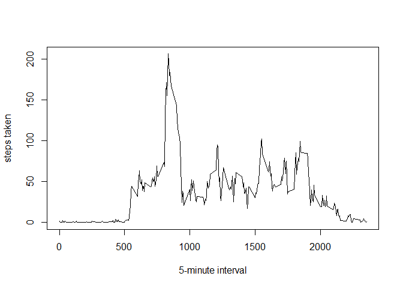
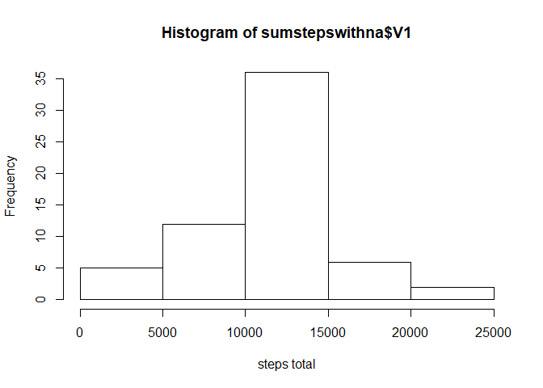
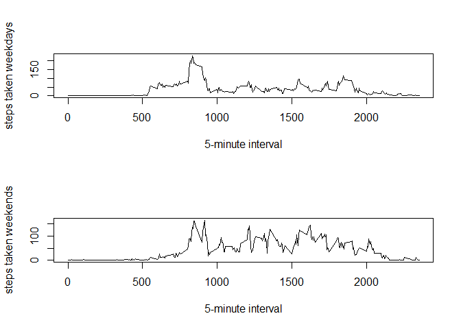

## Loading and preprocessing the data

```r
dataa <- read.csv("activity.csv")
```

## What is mean total number of steps taken per day?

```r
library(data.table)
DT <- data.table(dataa)
sumsteps <- DT[,sum(steps),by = date]
mean(sumsteps$V1,na.rm = TRUE)
```

```
## [1] 10766.19
```

```r
median(sumsteps$V1,na.rm = TRUE)
```

```
## [1] 10765
```

## What is the average daily activity pattern?

```r
avgint <- DT[,mean(steps,na.rm = TRUE),by = interval]
plot(avgint$interval,avgint$V1,xlab = "5-minute interval",ylab = "steps taken",type="l")
```

<!-- -->

```r
subset(avgint,avgint$V1 == max(avgint$V1))
```

```
##    interval       V1
## 1:      835 206.1698
```

## Imputing missing values

```r
sum(is.na(DT))
```

```
## [1] 2304
```

```r
nadata <- subset(DT,is.na(DT$steps))
addvalue <- merge(nadata,avgint)
addvalue[,2] <- NULL
colnames(addvalue)[3] <- "steps"
nonadata <- merge(DT,addvalue, by=c("date","interval"))
setDT(addvalue)

test <- addvalue[DT, on=c("date","interval")]
test[is.na(steps), steps := i.steps]
test[,i.steps := NULL]

sumstepswithna <- test[,sum(steps),by = date]

hist(sumstepswithna$V1,xlab="steps total")
```

<!-- -->

```r
mean(sumstepswithna$V1)
```

```
## [1] 10766.19
```

```r
median(sumstepswithna$V1)
```

```
## [1] 10766.19
```

## Are there differences in activity patterns between weekdays and weekends?

```r
test$date <- as.Date(test$date)
weekdaysd <- c('Monday', 'Tuesday', 'Wednesday', 'Thursday', 'Friday')
test$Wd <- factor((weekdays(test$date) %in%  weekdaysd),levels = c(FALSE, TRUE), labels = c("Weekend","Weekday"))

avginttwo <- test[,mean(steps),c("interval","Wd")]
avginttwowd <- subset(avginttwo,avginttwo$Wd=="Weekday")
avginttwowe <- subset(avginttwo,avginttwo$Wd=="Weekend")

par(mfrow=c(2,1))
plot(avginttwowd$interval,avginttwowd$V1,xlab = "5-minute interval",ylab = "steps taken weekdays",type="l")
plot(avginttwowe$interval,avginttwowe$V1,xlab = "5-minute interval",ylab = "steps taken weekends",type="l")
```

<!-- -->
